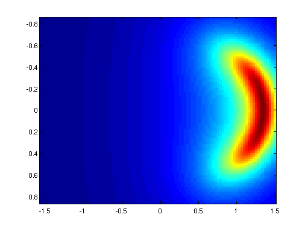
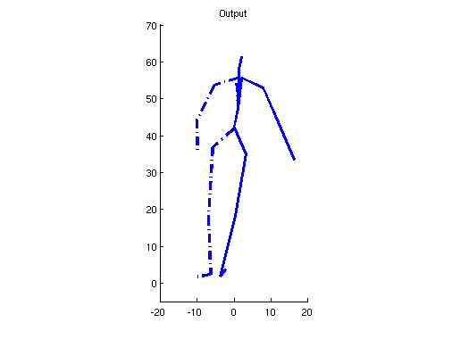
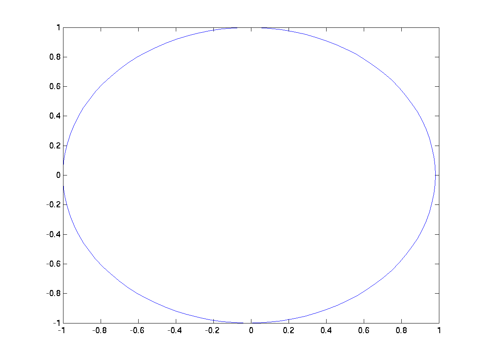

SGPLVM
======

Gaussian process latent variable models with shared latent spaces (SGPLVM)

## Release Information

As well as downloading the SGPLVM software you need to install the <a href="https://github.com/SheffieldML/GPmat">GPmat</a> toolbox.

## Examples

## SGP-LVM

```matlab
>> demSgplvm
```

Demo script to create three different types of Shared GP-LVM models
either using random data or a synthetic example of human motion.


```matlab
>> sgplvm_model_type = 'mlmi2008';
>> data_type = 'human';
```
The motion example was created by rotating a static pose around its
own axis both counter-clockwise and clockwise but use the same
descriptors which introduces ambiguities with respect to the heading
direction in the view-plane.

The SGP-LVM model created has a five dimensional latent space with two
private directions for each observation space and a single shared
direction. The model is initialised using the NCCA consolidation.


<p><center><br>

Kernel matrices to which NCCA consolidation is used to initialise the SGP-LVM model.

</center>

<p><center><br>

Unimodal silhouette. 

</center>

<p><center><br>

Bi-modal silhouette

</center></p>

## SGP-LVM FOLS

```matlab
>> dem_sgplvm_fols

```

Demo script that generates the toy example shown in Figure 1 in the paper <it> Factorized Orthogonal Latent Spaces, Salzmann et. al. </it>.

<p><center><br>

Observed data used for the example. Each observed space is the projection of the circle in the left most image onto each separate axis as shown in the right image.

</center>

<p><center><br>

The resulting embedding after learning a SGPLVM-FOLS model. The data is factorized into a single shared dimension and one single private dimension associated with each observed data space.

Demos last updated on Fri Jun 11 11:34:42 2010
